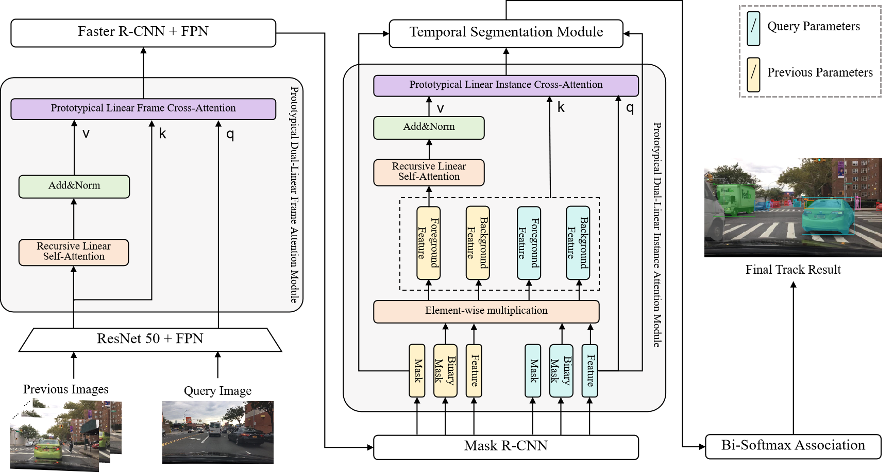

# Prototypical Dual-Linear Attention Network: Enhancing Multi-Object Tracking and Segmentation with Appearance and Spatio-temporal Features


This is the official implementation of PDLAN for MOTS. 


<div align="center">

</div>


## Abstract

Multi-object tracking and segmentation (MOTS) is a critical task in video analysis, with applications spanning autonomous driving, robot navigation and scene understanding. Previous methods primarily focus on limited spatio-temporal information and quadratic attention complexity, which lose partial scene details and restrict the model's ability to process long sequences. This paper proposes the Prototypical Dual-Linear Attention Network (PDLAN), a novel approach that effectively integrates both appearance and spatio-temporal information while maintaining linear complexity. The PDLAN employs recursive linear self-attention to strengthen appearance representation and prototypical linear cross-attention to condense rich spatio-temporal information, enhancing generalization ability. Extensive experiments on the large-scale BDD100K MOTS and KITTI MOTS datasets demonstrate that: 1) PDLAN can effectively address three main challenges of object occlusion, environmental lighting, and distant objects, showing a significant reduction in identity switches compared to previous trackers; 2) Ablation experiments further validate the importance of the prototypical dual-linear attention mechanism in improving tracking performance and optimizing segmentation effectiveness. Code is available at https://github.com/freekick0113/PDLAN#


## Prototypical Dual-Linear Attention Network(PDLAN)


## Main results

| Detector  | mMOTSA-val | mMOTSP-val | mIDF1-val | ID Sw.-val |   mAP-val  |
| :-------: | :--------: | :-------: | :--------: | :--------: | :--------: |
| ResNet-50 |    32.1    |   67.4    |    45.9    |     726    |    26.8    |

## Installation
Please refer to [INSTALL.md](docs/INSTALL.md) for installation instructions.

## Usages
Please refer to [GET_STARTED.md](docs/GET_STARTED.md) for dataset preparation and detailed running (training, testing, visualization, etc.) instructions.

## Citation
If you find PDLAN useful in your research or refer to the provided baseline results, please star :star: this repository and consider citing :pencil::
```
@inproceedings{pdlan,
  title={Prototypical Dual-Linear Attention Network: Enhancing Multi-Object Tracking and Segmentation with Appearance and Spatio-temporal Features},
  author={Yiqing Ren, Xuedong Wu, Haohao Fu,and Zhiyu Zhu},
  year={2025}
}
